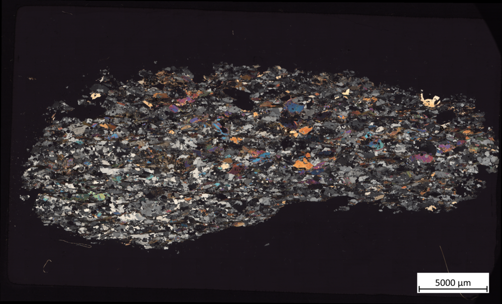

<!--
author:   Sebastian Zug; André Dietrich

email:    sebastian.zug@informatik.tu-freiberg.de

version:  0.0.4

language: de

import:   https://raw.githubusercontent.com/LiaTemplates/BeforeAndAfter/0.0.1/README.md

-->

# LiaScript meets GeoScience
<!--
persistent: true
-->

Dieses Beispiel illustriert die Verwendung von Darstellungen der [TUBAF Mediathek](https://mediathek.tu-freiberg.de) innerhalb von LiaScript-Lehrmaterialien.

> Die Webseite der Mediathek ist hier interaktiv eingefügt. Damit ließe sich zum Beispiel eine User-Story aufbauen.

??

## Einbettung einzelner Bilder anhand URL

    {{0-1}}

    {{1-2}}
*********************************************

<!-- style="filter: grayscale(80)" id="image" -->

Das ist ein etwas umfangreicheres Beispiel.
Hier wurden verschieden Filter über das Bild gelegt.

| Filter      | Wert                                                                                                                |
| ----------- | ------------------------------------------------------------------------------------------------------------------- |
| Grauwert    |                             |
| Helligkeit  |  |
| Kontrast    |    |
| Sättigung   |  |

Dieser begleitende Text eingefügt und ein Quizz zum Bild integriert.

__Welche Eigenschaften lassen sich aus diesem Dünnschliff ableiten?__

- [( )] keine Ahnung
- [(X)] ziemlich "fleckig"
- [( )] mit der Belichtung stimmt was nicht

*********************************************

## Einbettung von Bildern in einer Galerie

## Überlagerung von mehreren Bildern

<!-- style="max-width: 78vh;" -->
@beforeAndAfter(https://mediathek.tu-freiberg.de/eas/partitions-inline/2/0/80000/80790/feeb4ee9cc5e44f2731e2a764eae56a9cf599e8f/image/png,https://mediathek.tu-freiberg.de/eas/partitions-inline/2/0/81000/81387/2b9379093c840e6a716411ea85ac5d6ee5459188/image/png)

## Anmerkung
<!--
persistent: true
-->

> Die Bilder können auch vorkonfiguriert lokal gespeichert werden. Die vorgestellten Mechanismen sind dann identisch.

> oder es können auch direkt 3D-Modelle eingebettet werden:

??[3D-Modell](https://sketchfab.com/3d-models/familienschacht-freiberg-germany-7c7d30506c554385a4a4321366e2e601)